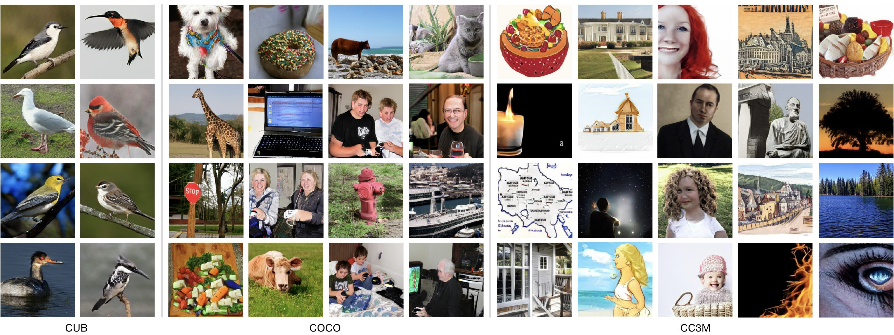

 
[](https://github.com/tobran/GALIP/blob/master/LICENSE.md)


[]((https://github.com/tobran/GALIP/graphs/commit-activity))

# GALIP

Official Pytorch implementation for our paper GALIP: Generative Adversarial CLIPs for Text-to-Image Synthesis


<p align="center">
<b>Generated Images
</p>



## Requirements
- python 3.9
- Pytorch 1.9
- At least 1x24GB 3090 GPU (for training)
- Only CPU (for sampling) (GALIP is a small and fast generative model which can generate multiple pictures in one second even on the CPU.)
## Installation

Clone this repo.
```
git clone https://github.com/tobran/GALIP
pip install -r requirements.txt
cd GALIP/code/
```


